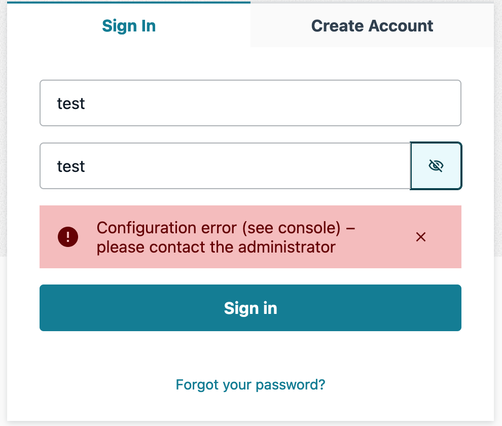

## Getting Started

First, create `.env.local` with an existing User Pool and client. Do not use an identity pool; we're not doing federated auth:

```bash
$ tee .env.local
AWS_DEFAULT_REGION=us-east-2
COGNITO_CLIENT_ID=xxxxxxxxxxxxxxxxxxxxxxxxxx
COGNITO_USER_POOL_ID=us-east-2_xxxxxxxxx
```

Then install packages and start the Next server:

```bash
npm install
npm run dev
```

Open [http://localhost:3000](http://localhost:3000) with your browser to see the result.

## Seeing the error

Enter any username and password and you will see this:


## Documentation

See [the relevant documentation](https://docs.amplify.aws/lib/auth/start/q/platform/js/#re-use-existing-authentication-resource) on the Amplify site.